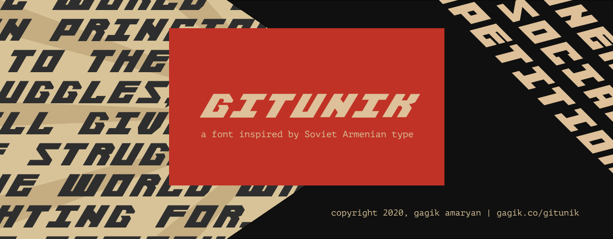

# Gitunik 
Gitunik is a font taking inspired by the Տեխնիկա (Technica) typeface by Henrik Mnatsakanyan, one of the pioneers of Soviet Armenian typography. It is heavily influenced by Russian Constructivism and features a bold and blocky design.

## About
**Gitunik** is the Armenian word for "a little scientist", a reference to the *Gitutiun and Technica* ("Science & Technology") magazine the logo of which featured Mnatsakanyan's work. 

")

Gitutyun & Technica logo (left) with Gitunik repeated transilitaration (right).

 

The font was made using Figma and FontForge and currently supports the entire Latin alphabet and some symbols (!,.()[ ] #).

It was developed with Soviet Modernist art in mind while also making sure the blocky design are accessible for both digital and print projects. The font pairs best with minimalistic geometry elements as well as monospace and sans-slab fonts.  

## Preview
Below you can find the font preview and some example usecases.

## Todo & Future Plans
1. [ ] Support proper OTF and fix font kerning issues.
2. [ ] Add support for numbers & symbols.
3. [ ] Intoduce slight stylistic differences between capitalized and non-capitalized letters.
4. [ ] Add support for Armenian & Cyrillic alphabet.